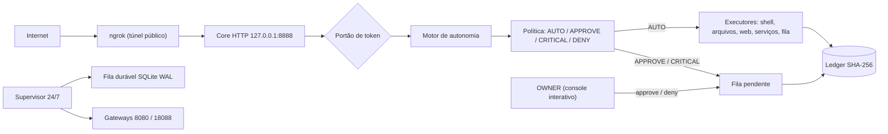

# Relatório do Sistema Specter

Data: 2026-10-03 · Escopo: `C:\Specter` (Core, túnel web, motor de autonomia)

## 1. Resumo executivo

O Specter é um conjunto de serviços locais em Python: supervisor 24/7, fila durável, gateways de inferência, federação de agentes via HTTP e túneis para a internet. Ao assumir, encontrei dois problemas graves. Corrigi os dois e adicionei um motor de **autonomia supervisionada**.

| Antes | Depois |
|---|---|
| Core HTTP (`:8888`) derrubava **toda** requisição (`TypeError` em `dispatch_decision`) | Roteamento corrigido na raiz (`dispatch` em vez de `dispatch_decision`) |
| `/api/exec` rodava PowerShell arbitrário **sem autenticação**, publicado na internet via ngrok | Token obrigatório; execução só pela política de autonomia |
| `read_file` / `list_dir` liam qualquer arquivo sem autenticação | Token obrigatório; segredos exigem aprovação CRITICAL |
| Servidor escutava em `0.0.0.0` | Escuta só em `127.0.0.1` (o túnel conecta pelo loopback) |
| 2 processos ngrok duplicados; túnel recusado (`ERR_NGROK_6030`) | Duplicata removida; túnel responde 200 |
| Agentes sem política nem registro auditável | Motor com 4 níveis, kill switch e ledger SHA-256 |

## 2. Arquitetura



### Serviços ativos

| Serviço | Porta | Função |
|---|---|---|
| Core | 8888 | Painel, federação, chat, API de autonomia |
| Gateway de inferência | 8080, 18088 | API compatível com OpenAI (standby) |
| Sovereign broker | 9999 | Broker local |
| Direct bridge | 9997 | Ponte com abas do navegador |
| ngrok | 4040 | Túnel público para o Core |
| cloudflared | 20241 | Túnel Cloudflare; ingress vazio, responde 503 a tudo |
| Supervisor 24/7 | — | Ciclos, saúde, fila `specter_fabric.sqlite3` |

## 3. Motor de autonomia (`specter_autonomy.py`)

### Níveis de decisão

| Nível | Comportamento | Exemplos |
|---|---|---|
| **AUTO** | Executa na hora | comandos somente-leitura da allowlist, escrita em `C:\Specter\Work`, leitura em `C:\Specter`, pesquisa e leitura de páginas públicas, reinício de serviços Specter, tarefas na fila |
| **APPROVE** | Fica `PENDING_APPROVAL` até o OWNER aprovar | comando fora da allowlist, escrita fora de `Work`, leitura fora de `C:\Specter` |
| **CRITICAL** | Igual, mas exige digitar o ID da ação | carteira, chaves, tokens, `.secret`, edição do próprio motor, desativar antivírus |
| **DENY** | Nunca executa | ação desconhecida, payload inválido, URL para rede interna |

### Garantias

- **Kill switch:** o arquivo `autonomy_halt.flag` bloqueia tudo, inclusive AUTO. `specter_cli.py halt` liga, e `unhalt` exige console interativo.
- **Ledger encadeado:** cada evento guarda o hash SHA-256 do anterior (`verify_ledger` aponta o ponto exato de qualquer adulteração).
- **Anti-SSRF:** `web_fetch` e `web_search` resolvem o DNS e recusam qualquer destino não público (loopback, rede privada, `169.254.x.x`). Redirects são revalidados a cada salto.
- **Conteúdo web não confiável:** o texto da página volta marcado `UNTRUSTED_WEB_CONTENT` e nunca é executado.
- **Sem aprovação via HTTP:** não existe rota de aprovar. O CLI exige TTY, então um agente rodando por `/api/exec` não se autoaprova.
- **Execução atômica:** a transição `QUEUED/PENDING → RUNNING` é uma única atualização, e uma ação nunca roda duas vezes.

### API HTTP (todas exigem token)

| Rota | Função |
|---|---|
| `POST /v1/autonomy/act` | Propõe uma ação `{kind, payload}` |
| `POST /v1/autonomy/actions` | Consulta uma ação ou lista (por status) |
| `POST /v1/autonomy/services` | Painel de status dos serviços |
| `POST /v1/autonomy/verify` | Verifica a cadeia do ledger |

### CLI do OWNER (`specter_cli.py`)

`halt`, `unhalt`, `act`, `pending`, `approve`, `deny`, `ledger`, `services` (além de `status`, `submit`, `results` que já existiam).

## 4. Evidências de verificação

| Teste | Resultado |
|---|---|
| Unitários (`test_specter_autonomy.py`) | **38/38** |
| Integração HTTP (servidor de teste, ledger isolado) | **14/14** |
| Pela URL pública do ngrok, exec AUTO | HTTP 200 |
| exec destrutivo | HTTP 202, `PENDING_APPROVAL` (APPROVE) |
| read_file de segredo | HTTP 202, `PENDING_APPROVAL` (CRITICAL) |
| web_fetch para `localhost` (SSRF) | HTTP 403, `DENIED` |
| web_fetch público / web_search | HTTP 200, `EXECUTED` (8 resultados) |
| Qualquer rota privilegiada sem token | HTTP 401 |
| Aprovar sem console interativo | Negado (exit 3) |
| Ledger | Íntegro, 18 eventos |

## 5. Riscos conhecidos e pendências

> [!WARNING]
> **Exposição anterior.** Até a correção, `/api/exec` esteve acessível na internet sem autenticação. O log do ngrok não registra requisições, então não dá para saber se houve acesso. Troque senhas e chaves que estavam em `C:\Specter`.

- **Token do cloudflared** apareceu na linha de comando do processo (visível a qualquer processo local). Recomendo rotacionar no painel da Cloudflare e passar por variável de ambiente.
- **ngrok duplicado:** não identifiquei qual script de boot lança dois processos. Pode reaparecer no próximo boot.
- **Sem isolamento:** o host não tem Docker nem WSL, então a execução livre de código dos agentes ainda não existe. A allowlist AUTO é restrita de propósito. O caminho recomendado é WSL2 + Ubuntu como zona livre.
- **Outras rotas públicas** (`/api/message`, `/v1/federation/join`, `submit_code`) seguem sem token por design, mas gravam em disco. Vale rate limit e cota.
- **Backup:** `Core\backups\specter_core_v3.py.20261003_075953.bak` (versão original, vulnerável).

## 6. Operação

```powershell
python C:\Specter\Core\specter_cli.py services   # painel de serviços
python C:\Specter\Core\specter_cli.py pending    # o que aguarda aprovação
python C:\Specter\Core\specter_cli.py approve <id>   # só em console interativo
python C:\Specter\Core\specter_cli.py halt       # kill switch
python C:\Specter\Core\specter_cli.py ledger     # histórico + verificação SHA-256
```

## 7. Roadmap para ampliar a autonomia com segurança

1. Instalar WSL2 + Ubuntu e criar a ação `sandbox_exec` (AUTO) com limites de CPU, RAM e tempo.
2. Pasta de trabalho compartilhada e fluxo "promover ferramenta": o agente cria, testa e pede entrada no Core; o OWNER aprova com 1 clique.
3. Rate limit e cotas nas rotas públicas de federação.
4. Rotação de credenciais e remoção de segredos de linhas de comando.
